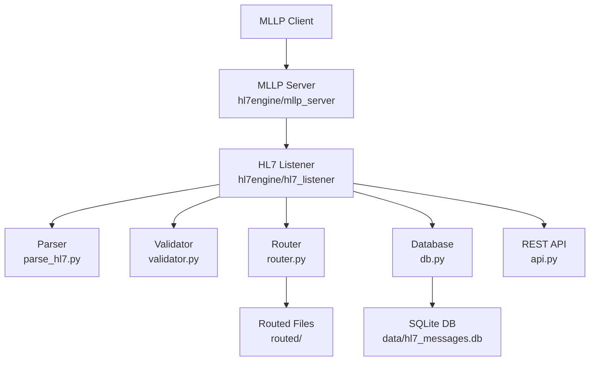

# Component Architecture

This diagram shows the major subsystems of the HL7v2 engine and how they interact during message ingestion, validation, routing, and storage. 
It provides a structural overview of the system before diving into routing and validation specifics.

The components are intentionally modular so each part can be tested, replaced, or extended independently.

## ASCII Diagram

See also:
- [Routing Logic](02_RoutingLogicDiagram.md)
- [Validation Pipeline](03_ValidationPipeline.md)

## Component Diagram

                   ┌──────────────────────────┐
                   │        MLLP Client        │
                   └──────────────┬────────────┘
                                  │
                                  ▼
                   ┌──────────────────────────┐
                   │       MLLP Server        │
                   │  hl7engine/mllp_server   │
                   └──────────────┬────────────┘
                                  │
                                  ▼
                   ┌──────────────────────────┐
                   │       HL7 Listener       │
                   │  hl7engine/hl7_listener  │
                   └──────────────┬────────────┘
        ┌──────────────────────────┼──────────────────────────┐
        ▼                          ▼                          ▼
┌──────────────┐          ┌──────────────┐          ┌────────────────┐
│    Parser    │          │  Validator   │          │    Router      │
│ parse_hl7.py │          │ validator.py │          │   router.py    │
└──────┬───────┘          └──────┬──────┘          └──────┬─────────┘
       │                          │                         │
       ▼                          ▼                         ▼
┌──────────────┐          ┌──────────────┐          ┌────────────────┐
│   Database   │          │   REST API   │          │  Routed Files  │
│    db.py     │          │    api.py    │          │   routed/...   │
└──────────────┘          └──────────────┘          └────────────────┘

## Mermaid Version

