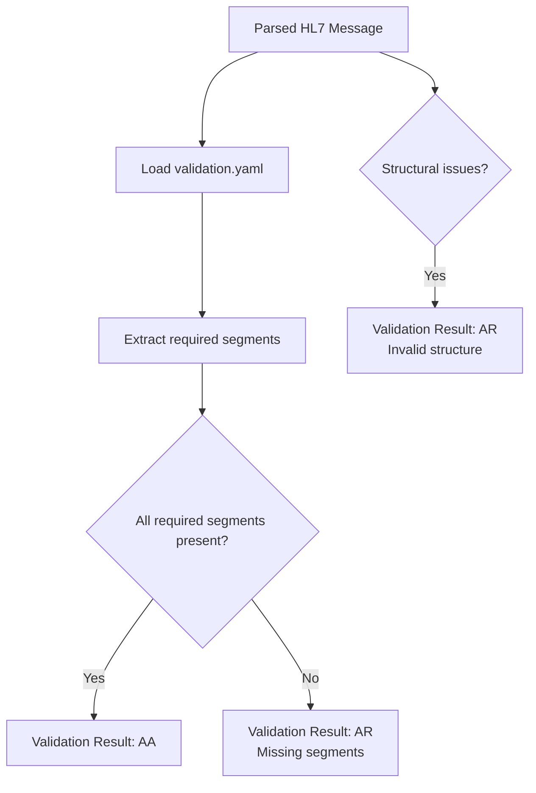

# Validation Pipeline

This diagram shows how the validator applies rules from `validation.yaml` to determine whether a message is accepted (AA) or rejected (AR).

## ASCII Version

                 ┌──────────────────────────────┐
                 │      Parsed HL7 Message      │
                 └──────────────┬───────────────┘
                                │
                                ▼
                 ┌──────────────────────────────┐
                 │       validation.yaml         │
                 │  required_segments, rules     │
                 └──────────────┬───────────────┘
                                │
                                ▼
                 ┌──────────────────────────────┐
                 │   Check required segments     │
                 │   e.g., PID, ORC, OBR         │
                 └──────────────┬───────────────┘
                                │
                 ┌──────────────┼───────────────┐
                 ▼              ▼               ▼
           All present?     Missing?       Invalid structure?
                 │              │               │
                 ▼              ▼               ▼
              Result:         Result:          Result:
                AA              AR               AR

## Mermaid Version

