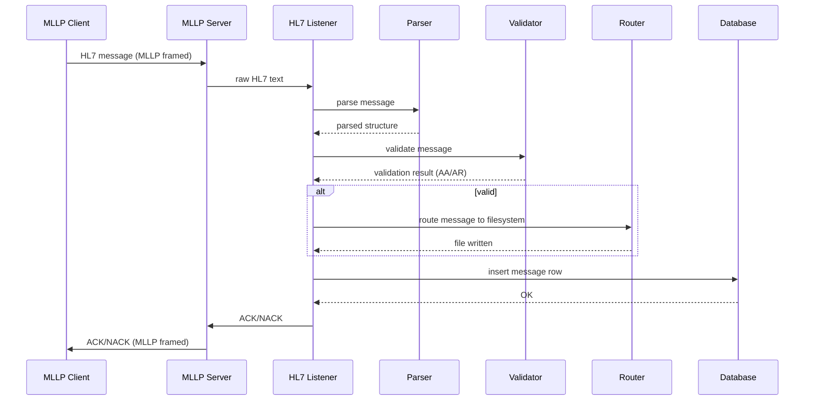

# HL7v2 Parser & Routing Engine – Architecture Overview

This document provides a high‑level overview of the HL7v2 ingestion and routing system. It explains how messages flow through the system, how components interact, and how configuration files influence behavior. The following documents contain the detailed diagrams:
- Component Architecture — 01_ComponentDiagram.md
- Routing Logic — 02_RoutingLogicDiagram.md
- Validation Pipeline — 03_ValidationPipeline.md

## System Summary

The system ingests HL7v2 messages over MLLP, validates them using YAML‑based rules, routes them to file‑based destinations, stores them in a SQLite database, and exposes them via a REST API. The architecture emphasizes modularity, testability, and configurability.

# System Purpose
The system ingests HL7v2 messages over MLLP, validates them, routes them to file-based destinations based on configurable rules, stores them in a SQLite database, and exposes them via a REST API. It is designed to be:
- modular
- testable
- configuration-driven
- easy to extend
- suitable for both demo and production environments

The system is designed to:
- receive HL7v2 messages over MLLP
- parse and validate them
- route them to folders based on configurable rules
- store them in a SQLite database
- expose stored messages via a REST API
- support both demo and production environments
The design focuses on clarity, extensibility, and predictable behavior.

# Short Description
-------------------
The architecture processes HL7v2 messages end‑to‑end:
- MLLP Server receives framed HL7 messages from external systems.
- HL7 Listener orchestrates parsing, validation, routing, and storage.
- Parser extracts segments, fields, message type, trigger, and control ID.
- Validator checks required segments and structural correctness using validation.yaml.
- Router determines the output folder using routes.yaml and writes the message to disk.
- Database layer stores the message metadata and raw HL7 text.
- REST API exposes stored messages for UI or integration use.
- ACK/NACK is generated and returned to the sender.
This modular flow ensures each subsystem is independently testable and replaceable.

# End‑to‑End Description
------------------------
The system processes HL7v2 messages through a sequence of well‑defined stages, each handled by a dedicated component. The flow begins when an external system sends an HL7 message over an MLLP connection. The MLLP server receives the framed message, extracts the raw HL7 content, and forwards it to the HL7 listener.
The listener coordinates the core processing pipeline. It first invokes the parser, which normalizes the message, splits it into segments and fields, and extracts key metadata such as message type, trigger event, and control ID. The parsed structure is then passed to the validator, which applies rules from validation.yaml to ensure required segments are present and the message is structurally sound. Messages that fail validation are marked as rejected and still recorded for traceability.
Valid messages proceed to the router, which uses routes.yaml to determine the correct output folder based on message type and trigger. The router writes the original HL7 message to the appropriate directory using the control ID as the filename. In parallel, the listener stores the message and its metadata in the SQLite database, enabling later retrieval through the REST API and the UI viewer.
After processing, the listener generates an HL7 ACK or NACK depending on the validation outcome and returns it to the sender through the MLLP server. This completes the round‑trip communication and ensures the sender receives immediate feedback.
The architecture is intentionally modular: each component is isolated, testable, and replaceable. Configuration files define routing and validation behavior, allowing the system to adapt to new message types or workflows without code changes. The result is a predictable, extensible HL7v2 processing engine suitable for both demonstration and real‑world integration scenarios.

# Detailed Description
----------------------
Description, how this architecture now works end‑to‑end.
The system is now cleanly separated into two layers:
1. Transport layer (mllp_server.py)
- Accepts TCP connections
- Handles MLLP START/END block framing
- Reassembles fragmented messages
- Extracts raw HL7 text
- Passes (raw_hl7, sender_ip) to the listener
- Wraps returned ACK in MLLP and sends it back
This layer is now simple, robust, and testable.
2. HL7 processing layer (hl7_listener.py)
- Normalizes HL7
- Parses via hl7apy
- Validates via YAML rules
- Routes via YAML router
- Logs JSON events
- Stores messages in SQLite
- Builds ACK/NACK
- Returns plain HL7 ACK string (no MLLP framing)
This layer is now pure logic — no sockets, no buffers, no threading — which makes it:
- unit-testable
- reusable
- predictable
- easy to extend

This is exactly the architecture used in production HL7 engines.

## High-Level Data Flow (ASCII)

1. High-Level Architecture
ASCII Overview

                ┌────────────────────────────┐
                │        MLLP Client         │
                │ (LIS, HIS, Lab Analyzer…)  │
                └──────────────┬─────────────┘
                               MLLP 
                               │
                               ▼
                ┌────────────────────────────┐
                │        MLLP Server (2575)  │
                │  (hl7engine/mllp_server)   │
                └──────────────┬─────────────┘
                               │ raw HL7
                               ▼
                ┌────────────────────────────┐
                │        HL7 Listener        │
                │ (parse → validate → route) │
                └──────────────┬─────────────┘
                               │ parsed HL7
                               ▼
        ┌──────────────┬───────────────┬────────────────┐
        │               │               │                │
        ▼               ▼               ▼                ▼
   Parser           Validator         Router          Database
(parse_hl7)     (validation.yaml)   (routes.yaml)   (SQLite storage)

With this structure after server-tuning:

                ┌──────────────────────────┐
                │        HL7 Client        │
                └──────────────┬───────────┘
                              │ MLLP (2575)
                ┌──────────────▼───────────┐
                │      MLLP Listener        │
                └──────────────┬───────────┘
                              │
                              ▼
                        Message Queue
                              │
                              ▼
                        Worker Pool (N)
                              │
                              ▼
                        Router → routed/<dest>/*.hl7
                              │
                              ▼
                        Validator (schema + rules)
                              │
                              ▼
                        ACK Generator
                              │
                              ▼
                        Prometheus Metrics (8010)

2. Component Architecture
2.1 MLLP Server (hl7engine/mllp_server.py)
Handles:
- TCP socket listening
- MLLP framing (0x0b ... 0x1c0d)
- connection lifecycle
- passing raw HL7 messages to the listener
- sending ACK/NACK responses
Key characteristics:
- synchronous, single-threaded
- processes messages sequentially
- robust against fragmented or multiple messages per connection

2.2 HL7 Listener (hl7engine/hl7_listener.py)
Central orchestrator:
- Receives raw HL7 text
- Parses into segments
- Validates message structure
- Routes message to filesystem
- Stores message in SQLite
- Generates ACK/NACK
This is the “brain” of the system.

2.3 Parser (hl7engine/parse_hl7.py)
Responsibilities:
- split message into segments
- split segments into fields
- extract message type, trigger event, control ID
- normalize line endings
- handle multiple OBX segments
The parser is intentionally simple and deterministic.

2.4 Validator (hl7engine/validator.py)
Uses validation.yaml to enforce:
- required segments (e.g., PID, ORC, OBR)
- allowed message types
- minimal structural correctness
Validation results:
- AA — accepted
- AR — rejected (e.g., missing ORC)
The validator does not enforce deep HL7 semantics; it ensures structural integrity.

2.5 Router (hl7engine/router.py)
Uses routes.yaml to determine:
- parent folder (e.g., routed/ORU)
- trigger-specific folder (e.g., routed/ORU/R01)
- fallback behavior if trigger not defined
- filename = <control_id>.hl7
Writes files with:
- flush
- optional fsync (disabled in tests for performance)

2.6 Database Layer (hl7engine/db.py)
Stores:
- control ID
- message type
- trigger
- raw HL7
- timestamp
Two DBs exist:
- seed DB (data/seed/hl7_messages_demo.db) — committed once
- runtime DB (data/hl7_messages.db) — ignored by Git
On startup, if runtime DB is missing, it is copied from the seed DB.

2.7 REST API (hl7engine/api.py)
Provides:
- list messages
- retrieve message by ID
- filter by type/trigger
- serve UI viewer
Powered by FastAPI.

3. Data Flow
ASCII Data Flow

MLLP Message
     │
     ▼
MLLP Server
     │ raw HL7
     ▼
HL7 Listener
 ┌───────────────┬────────────────┬────────────────┐
 │               │                │                │
 ▼               ▼                ▼                ▼
Parser       Validator         Router          Database
 │               │                │                │
 │ parsed HL7    │ validation     │ file write     │ insert row
 │               │ result         │                │
 └───────────────┴────────────────┴────────────────┘
                     │
                     ▼
                 ACK/NACK

4. Sequence Diagram (Mermaid)
Mermaid diagrams render beautifully in GitHub, GitLab, VS Code, and MkDocs.

5. Configuration Architecture
5.1 routes.yaml
Defines routing rules:
ORU:
  R01: routed/ORU/R01
ADT:
  A01: routed/ADT/A01

Fallback behavior:
- if trigger folder exists → use it
- else → use parent folder

5.2 validation.yaml
Defines required segments:
ORU:
  R01:
    required_segments:
      - PID
      - OBR

Validation is structural, not semantic.

6. Runtime Directories
- routed/ — output files
- received/ — optional raw input
- data/ — runtime DB
- data/seed/ — committed demo DB
- logs/ — runtime logs
All except data/seed/ are ignored by Git.

7. Testing Architecture
The test suite covers:
- parser correctness
- validator behavior
- router logic
- MLLP framing
- integration (listener + router + DB)
- stress tests (100 messages)
- YAML schema validation
Fixtures ensure:
- clean routed/ before each test
- clean runtime DB before test session

8. Deployment Considerations
- SQLite is fine for demo/single-user
- WAL mode recommended for higher throughput
- For production: PostgreSQL or MySQL
- MLLP server can be parallelized using threads or asyncio
- Routing can be offloaded to a worker thread

9. Future Improvements
- async MLLP server
- thread pool for DB writes
- routing queue
- message replay
- metrics + monitoring

